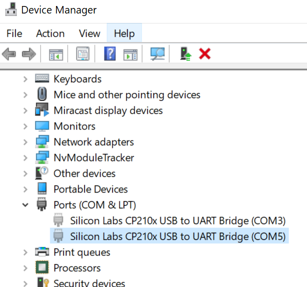
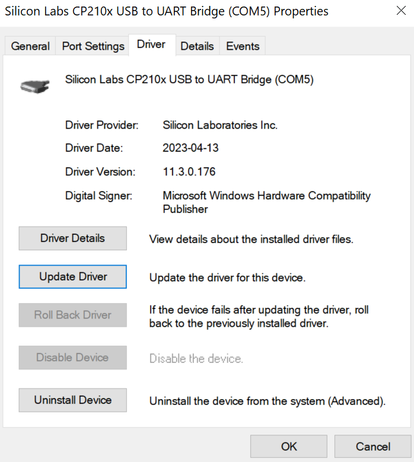
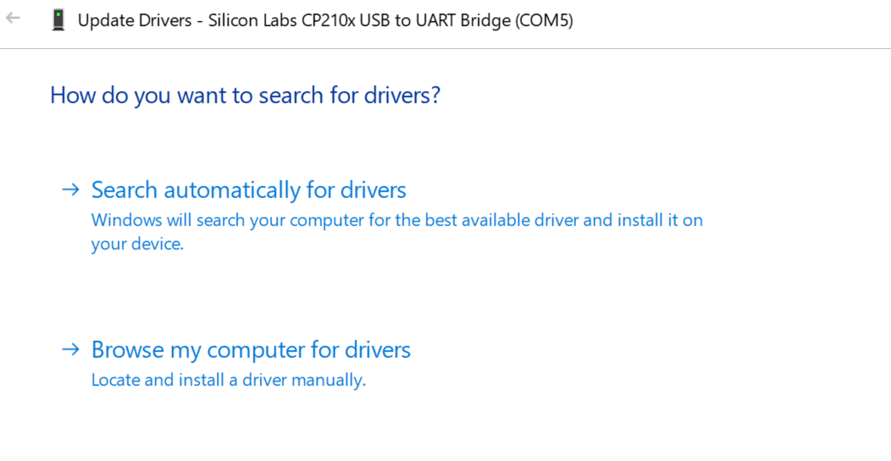

# module testing | data acquisition

[serial_to_csv.py](serial_to_csv.py) is a serial monitoring application which displays live data to terminal and also writes all the data to [data.csv](data.csv).

[sketch_a2d_daq_module_testing](sketch_a2d_daq_module_testing) contains the sketch(arduino firmware) for the [A2D 64CH DAQ](https://github.com/mbA2D/A2D_DAQ)

## thermistors & daq

thermistors provide resistance as a function of temperature:
[NTC 10K 3380s](https://octopart.com/nxrt15xh103fa1b030-murata-25915268). the daq measures the voltage across a thermistor using a voltage divider configuration:
[A2D 64CHDAQ Hardware Documentation (by mbA2D)](</documentation/A2D_64CHDAQ_Hardware_Documentation_(Draft).pdf>)

the voltage can be used to calculate the resistance of the thermistor, from which temperature can be interpolated: [thermistor_calc.py](thermistor_calc.py)

$$R_{\text{{thermistor}}} = \frac{{V_{\text{{thermistor}}}}}{{V_{\text{{daq}}} - V_{\text{{thermistor}}}}} \cdot R_{\text{{daq}}}$$

$$T = \frac{1}{{\frac{1}{{T_0}} + \frac{1}{B} \cdot \ln(R_{\text{{thermistor}}})}}$$

## steps

1. git clone library
2. download, install and unzip: https://www.silabs.com/documents/public/software/CP210x_Universal_Windows_Driver.zip.
3. connect the daq via usb
4. run serial_to_csv.py in your respective directory via terminal

## troubleshooting

If Arduino IDE cannot find the port then make sure you are using a USB capable of data-transfer & you have the CP210x Driver installed: https://www.silabs.com/documents/public/software/CP210x_Universal_Windows_Driver.zip

If having trouble setting up:

1. Navigate to device manager > view > show hidden devices > ports
   
2. Click on Silicon Labs CP210x > Driver > Update Driver > Browse my computer for drivers. > Select unzipped folder: CP210x_Universal_Windows_Driver
   
   

## to-do

calibrate the thermistors: [thermistor calibration](https://www.mstarlabs.com/sensors/thermistor-calibration.html)

## acknowledgments

hardware, libraries, and documentation for the [A2D 64CH DAQ](https://github.com/mbA2D/A2D_DAQ) were created/designed by [mbA2D](https://github.com/mbA2D)
